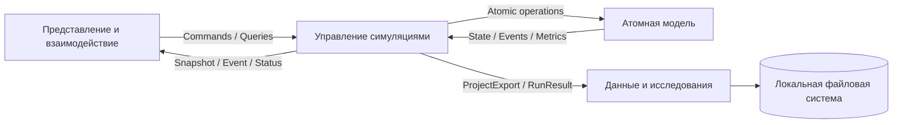
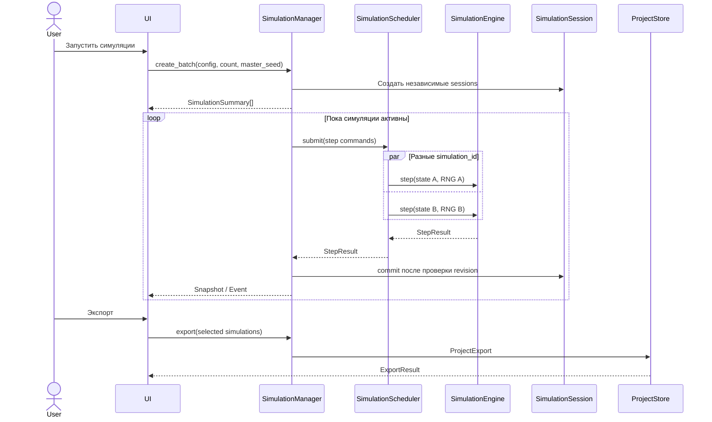

# Архитектура Gamma Irradiation Application

## 1. Назначение документа

Документ является техническим заданием на преобразование текущего проекта в модульный монолит.

Система предназначена для локальной работы одного-двух пользователей, параллельного запуска нескольких симуляций металлической решётки и сохранения результатов на локальном компьютере.

Архитектура включает четыре функциональных блока:

1. Атомная модель.
2. Управление симуляциями.
3. Данные и исследования.
4. Представление и взаимодействие.

## 2. Архитектурные принципы

- Проект поставляется и запускается как одно локальное приложение.
- Доменная логика не зависит от FastAPI, React и файловой системы.
- Каждая симуляция имеет отдельные состояние, историю, RNG и очередь команд.
- Разные симуляции могут выполняться параллельно.
- Команды одной симуляции выполняются строго последовательно.
- Новое состояние фиксируется только после проверки инвариантов.
- При ошибке сохраняется последний корректный snapshot.
- Renderer получает готовый `RenderFrame` и не вычисляет физическую логику.
- Между блоками передаются только версионированные DTO.
- Хранение проектов осуществляется через абстракцию репозитория.

## 3. Структура проекта

```text
apps/backend/
├── atomic_model/
│   ├── topology.py
│   ├── state.py
│   ├── events.py
│   ├── event_executor.py
│   ├── cascade_stub.py
│   ├── metrics.py
│   ├── engine.py
│   └── errors.py
├── simulation_management/
│   ├── session.py
│   ├── history.py
│   ├── manager.py
│   ├── scheduler.py
│   ├── snapshots.py
│   ├── event_hub.py
│   └── errors.py
├── data_research/
│   ├── project_store.py
│   ├── serialization.py
│   ├── experiments.py
│   ├── statistics.py
│   ├── export.py
│   └── errors.py
├── contracts/
│   ├── simulation.py
│   ├── projects.py
│   └── errors.py
└── api/
    ├── models.py
    ├── simulations.py
    ├── projects.py
    ├── experiments.py
    └── websocket.py

apps/frontend/src/
├── app/
├── api/
├── contracts/
├── simulations/
├── configuration/
├── store/
├── rendering/
│   ├── common/
│   ├── canvas2d/
│   └── three3d/
├── diagnostics/
├── projects/
└── export/
```

## 4. Общая схема зависимостей



Допустимые зависимости:

```text
Frontend → API contracts
API → Simulation Management
Simulation Management → Atomic Model
Simulation Management → Data and Research
Data and Research → Contracts
Atomic Model → Contracts или собственные доменные типы
```

Запрещённые зависимости:

- атомная модель → FastAPI;
- атомная модель → frontend;
- атомная модель → файловая система;
- renderer → атомная модель;
- project storage → внутренние приватные поля атомной модели;
- API controller → непосредственное изменение `SimulationState`.

# 5. Блок «Атомная модель»

## 5.1 `Topology`

### Назначение

Хранение неизменяемой геометрии 2D- или 3D-решётки.

### Ответственность

- создание `lattice`, `interstitial`, `bridge`, `hollow` позиций;
- формирование связей соседства;
- определение поверхностных позиций;
- получение поддерживающих узлов;
- вычисление расстояний и направлений;
- проверка существования позиции.

### Вход

- размеры решётки;
- размерность 2D/3D.

### Выход

- неизменяемый набор `Site`;
- граф соседства;
- запросы `neighbors()`, `supports()`, `distance()`.

### Ограничения

- после создания топология не изменяется;
- все связи соседства должны ссылаться на существующие позиции;
- связи соседства должны быть симметричными, если тип связи не определён как направленный.

## 5.2 `SimulationState`

### Назначение

Хранение физического состояния одной симуляции.

### Ответственность

- хранение атомов и их текущих позиций;
- ведение обратного индекса занятости;
- хранение номера акта и накопленной дозы;
- хранение доменной revision;
- создание рабочей копии состояния;
- проверка базовых инвариантов состояния.

### Основные данные

```text
atoms: AtomId → SiteKey
occupied: SiteKey → AtomId
act_number: int
total_dose_ev: float
revision: int
```

### Ограничения

- один атом занимает одну позицию;
- одна позиция занята не более чем одним атомом;
- все позиции присутствуют в `Topology`;
- количество атомов не меняется при обычном событии.

## 5.3 `EventEngine`

### Назначение

Определение допустимых событий и выбор события для атома.

### Ответственность

- правила внутренних атомов;
- правила поверхностных атомов;
- правила межузельных атомов;
- правила поверхностных дефектов;
- применение энергетических порогов;
- расчёт направляющих коэффициентов;
- нормировка весов;
- расчёт диагностических вероятностей;
- выбор события через переданный `RandomSource`.

### Вход

- `Topology`;
- `SimulationState`;
- atom ID;
- энергия;
- пороги и веса;
- `RandomSource` для выбора события.

### Выход

- список `EventCandidate`;
- список `ProbabilityOutcome`;
- выбранный `EventCandidate` либо `NoChange`.

### Ограничения

- диагностический расчёт вероятностей не изменяет RNG;
- активные вероятности нормированы до 1;
- событие не может ссылаться на недопустимую позицию.

## 5.4 `EventExecutor`

### Назначение

Применение выбранного атомного события к рабочему состоянию.

### Ответственность

- перемещение атома;
- обмен атомов;
- образование пары Френкеля;
- рекомбинация;
- переходы между lattice/interstitial/surface;
- формирование списка изменённых атомов;
- формирование доменного события.

### Вход

- рабочая копия `SimulationState`;
- `EventCandidate`.

### Выход

- изменённое рабочее состояние;
- `DomainEvent`;
- список затронутых atom ID.

### Ограничения

- исходное зафиксированное состояние не изменяется;
- частичное применение события недопустимо;
- после применения вызывается проверка инвариантов.

## 5.5 `CascadeStub`

### Назначение

Временная заглушка для будущего расширения вторичных перемещений.

### Ответственность

- предоставить стабильную точку расширения;
- не выполнять дополнительных перемещений;
- не изменять состояние и RNG.

### Вход

- рабочее состояние;
- основное доменное событие.

### Выход

- пустой список дополнительных событий.

Заглушка не входит в обязательное тестовое покрытие до начала реализации соответствующей функциональности.

## 5.6 `MetricsCalculator`

### Назначение

Чистый расчёт доменных метрик.

### Метрики

- корректно расположенные атомы;
- вакансии;
- межузельные атомы;
- поверхностные дефекты;
- суммарное число дефектов;
- энтропия;
- доза на атом.

### Вход

- `Topology`;
- `SimulationState`.

### Выход

- `SimulationMetrics`.

Класс не изменяет состояние.

## 5.7 `SimulationEngine`

### Назначение

Координация одной атомарной операции доменной модели.

### Ответственность

- создание начального состояния;
- выполнение одного шага;
- выполнение ручного перемещения;
- получение диагностических вероятностей;
- вызов `EventEngine`, `EventExecutor` и временной заглушки `CascadeStub`;
- проверка инвариантов;
- расчёт метрик;
- возврат результата без фиксации его в пользовательской сессии.

### Публичный интерфейс

```text
create_initial_state(config, random_source) → InitialStateResult
step(state, random_source, forced_energy?) → StepResult
move(state, move_command) → StepResult
probabilities(state, atom_id, energy) → ProbabilityOutcome[]
destinations(state, atom_id) → Destination[]
```

# 6. Блок «Управление симуляциями»

## 6.1 `SimulationSession`

### Назначение

Владение состоянием и жизненным циклом одной симуляции.

### Основные данные

```text
simulation_id
configuration
status
state
random_state
history
command_queue
lock
last_valid_snapshot
error
```

### Ответственность

- атомарная фиксация `StepResult`;
- защита от параллельного изменения одной модели;
- хранение последнего корректного состояния;
- проверка `expected_revision`;
- изменение статуса симуляции.

## 6.2 `SimulationHistory`

### Назначение

Хранение checkpoint-истории одной симуляции.

### Ответственность

- commit нового checkpoint;
- undo/redo;
- удаление redo-ветки после нового шага;
- хранение состояния RNG вместе с физическим состоянием;
- ограничение размера истории при необходимости.

## 6.3 `SimulationManager`

### Назначение

Главный application service для управления симуляциями.

### Ответственность

- создание одной симуляции;
- создание группы симуляций;
- получение и удаление сессий;
- запуск, пауза и остановка;
- step, move, undo, redo;
- проверка допустимости команды для текущего статуса;
- передача вычислительной команды Scheduler;
- публикация результата через `EventHub`;
- передача данных в блок хранения.

### Публичный интерфейс

```text
create(config) → SimulationSummary
create_batch(config, count, master_seed) → SimulationSummary[]
step(simulation_id, expected_revision) → StepResponse
run(simulation_id) → SimulationSummary
pause(simulation_id) → SimulationSummary
stop(simulation_id) → SimulationSummary
undo(simulation_id) → SimulationSnapshot
redo(simulation_id) → SimulationSnapshot
list() → SimulationSummary[]
get_snapshot(simulation_id) → SimulationSnapshot
```

## 6.4 `SimulationScheduler`

### Назначение

Ограниченное параллельное выполнение вычислительных команд.

### Ответственность

- приём задач разных симуляций;
- FIFO-порядок команд одной симуляции;
- параллельный запуск команд разных симуляций;
- ограничение `max_parallel_simulations`;
- отмена ожидающих задач;
- timeout вычислительной команды;
- возврат структурированной ошибки.

### Правила

- одновременно выполняется не более одной команды для одного `simulation_id`;
- ошибка задачи не останавливает Scheduler;
- результат связывается с исходными `simulation_id` и `expected_revision`.

## 6.5 `SnapshotFactory`

### Назначение

Преобразование внутренней сессии в публичные DTO.

### Выходные DTO

- `SimulationSnapshot`;
- `SimulationSummary`;
- `StepResponse`;
- `SimulationError`.

Внутренние mutable-объекты не должны попадать в DTO.

## 6.6 `EventHub`

### Назначение

Доставка событий клиентам.

### Ответственность

- подписки по `simulation_id`;
- публикация snapshot, event, status, progress и error;
- удаление отключённых клиентов;
- сохранение порядка сообщений одной симуляции по revision.

# 7. Блок «Данные и исследования»

## 7.1 `ProjectSerializer`

### Назначение

Преобразование DTO между объектным и файловым представлением.

### Поддерживаемые форматы

- JSON для конфигурации и snapshots;
- JSONL для событий;
- CSV для временных рядов метрик.

### Ответственность

- запись `schema_version`;
- проверка обязательных полей;
- загрузка поддерживаемых версий;
- миграция старой версии при наличии правила миграции.

## 7.2 `ProjectStore`

### Назначение

Локальное хранение проектов.

### Ответственность

- создание проекта;
- сохранение и загрузка;
- перечисление проектов;
- сохранение checkpoint;
- добавление события и строки метрик;
- атомарная замена проекта;
- защита от выхода за пределы каталога проектов.

### Публичный интерфейс

```text
save(project_export, overwrite=False) → ProjectMetadata
load(project_id) → ProjectExport
list() → ProjectMetadata[]
save_checkpoint(simulation_id, snapshot)
append_event(simulation_id, event)
append_metrics(simulation_id, metrics)
```

## 7.3 `ExperimentService`

### Назначение

Организация серии независимых симуляций.

### Ответственность

- формирование серии конфигураций;
- получение производных seeds из master seed;
- создание симуляций через `SimulationManager`;
- контроль прогресса;
- завершение или отмена всей серии;
- передача результатов в `StatisticsCalculator`.

## 7.4 `StatisticsCalculator`

### Назначение

Расчёт агрегированных исследовательских показателей.

### Ответственность

- среднее;
- минимум и максимум;
- percentiles;
- bootstrap confidence intervals;
- сравнение траекторий;
- формирование `AggregateResult`.

Класс работает только с `SimulationMetrics` и не интерпретирует расположение атомов.

## 7.5 `ResultExporter`

### Назначение

Формирование переносимого результата выбранных симуляций.

### Ответственность

- выбор согласованных revisions;
- создание manifest;
- экспорт конфигурации и seeds;
- экспорт snapshots, событий и метрик;
- экспорт агрегированных результатов;
- запись во временный каталог;
- атомарное переименование после успешной записи.

# 8. Блок «Представление и взаимодействие»

Для frontend используются React-компоненты, hooks и store, а не классы предметной модели.

## 8.1 `AppShell`

- компоновка приложения;
- глобальная обработка ошибок;
- подключение store и API-клиента;
- навигация между симуляциями и проектами.

## 8.2 `SimulationList`

- список активных симуляций;
- статус, progress и revision;
- выбор текущей симуляции;
- создание и удаление симуляций.

## 8.3 `SimulationControls`

- step, run, pause, stop;
- undo/redo;
- блокировка недоступных команд;
- отображение состояния команды.

## 8.4 `ConfigurationEditor`

- размерность и размеры;
- profile;
- seed/master seed;
- число параллельных запусков;
- пороги и веса;
- предварительная клиентская валидация.

## 8.5 `simulationStore`

Хранит данные отдельно для каждого `simulation_id`:

```text
summary
current_snapshot
last_valid_snapshot
events
metrics
connection_status
error
```

Snapshot с revision меньше или равной текущей не применяется повторно.

## 8.6 `simulationApi`

- HTTP-команды;
- WebSocket-подписки;
- преобразование HTTP-ошибок в `ApplicationError`;
- повторное подключение WebSocket;
- маршрутизация сообщений по `simulation_id`.

## 8.7 `snapshotMapper`

### Назначение

Граница между backend snapshot и renderer.

### Ответственность

- runtime-валидация DTO;
- проверка `schema_version`;
- преобразование `SimulationSnapshot` в `RenderFrame`;
- fallback для неизвестного visual state;
- отклонение некорректного snapshot с сохранением `last_valid_snapshot`.

## 8.8 `Lattice2DRenderer`

- Canvas-отрисовка `RenderFrame`;
- отображение атомов и вакансий;
- выбор атома;
- передача пользовательского намерения перемещения;
- отсутствие расчётов физической допустимости.

## 8.9 `Lattice3DRenderer`

- Three.js-сцена;
- вращение, масштабирование и выбор атома;
- отображение `RenderFrame`;
- освобождение WebGL-ресурсов;
- отсутствие физической логики.

## 8.10 `DiagnosticsPanel`

- текущие метрики;
- графики;
- журнал событий;
- диагностические вероятности;
- состояние выбранного атома;

## 8.11 `ProjectPanel` и `ExportPanel`

- список локальных проектов;
- save/load;
- выбор симуляций для экспорта;
- выбор формата;
- отображение результата и пути к файлам.

# 9. Контракты между блоками

## 9.1 `SimulationConfig`

Содержит размеры, профиль, начальные дефекты, пороги, веса и параметры seed.

## 9.2 `SimulationCommand`

```text
command_id
simulation_id
expected_revision
command_type
payload
```

## 9.3 `SimulationSnapshot`

```text
schema_version
simulation_id
revision
status
dimensions
atoms
vacancies
metrics
history_capabilities
```

## 9.4 `SimulationEvent`

```text
event_id
simulation_id
revision
act
event_type
energy_ev
affected_atom_ids
```

## 9.5 `RenderFrame`

Содержит только данные, необходимые renderer: размеры, координаты, визуальные состояния и выделение.

# 10. Основной поток выполнения



# 11. Обработка ошибок

- Доменная ошибка не должна изменять зафиксированное состояние.
- При ошибке шага сессия сохраняет `last_valid_snapshot`.
- Ошибка одной сессии переводит только её в `FAILED`.
- Scheduler продолжает выполнять другие сессии.
- Renderer error boundary не должен ломать управление симуляцией.
- Ошибка экспорта не должна повреждать существующий проект.
- Все ошибки возвращаются как версионированный `ApplicationError`.

# 12. Критерии приёмки архитектурной реализации

- В коде отсутствует глобальная единственная модель.
- Поддерживается несколько активных `simulation_id`.
- Состояния разных симуляций изолированы.
- Команды одной симуляции сериализованы.
- Разные симуляции выполняются параллельно в пределах настройки Scheduler.
- Атомная модель запускается в тестах без FastAPI и React.
- Renderer работает только с `RenderFrame`.
- RNG state входит в checkpoint и экспорт.
- Сохранение выполняется во временный каталог с последующей атомарной заменой.
- Все публичные DTO имеют `schema_version`.
- Ошибка шага, renderer или экспорта не уничтожает последний корректный snapshot.
