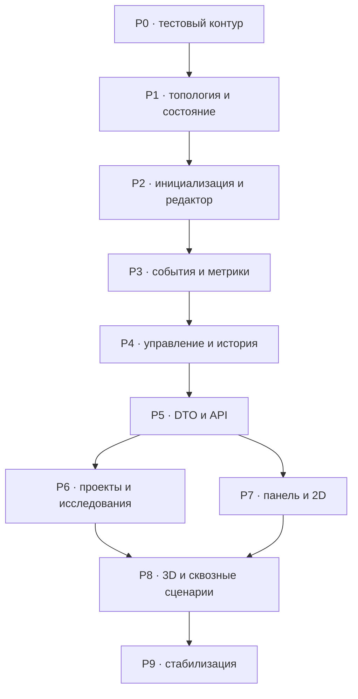

# План правок новой архитектуры

**Статус:** рабочий план реализации, код ещё не изменяется  
**Дата сверки:** 2026-09-27  
**Основание:** фактический код проекта, `TZ_*.md`, `FUNCTIONAL_COVERAGE.md`, ADR-0089—ADR-0120  
**Область:** только дельта — удаляемое, изменяемое и добавляемое. Уже соответствующий ТЗ функционал здесь не повторяется.

## 1. Цель и правило выполнения

Цель — привести текущую модульную реализацию к согласованной модели F-01—F-27, не меняя каноническое разделение на крупные модули.

Каждый этап выполняется строго так:

1. Добавить или заменить тесты, описывающие новый контракт; убедиться, что они падают по ожидаемой причине (`RED`).
2. Внести минимальную реализацию этапа (`GREEN`).
3. Удалить ставший недостижимым старый код и старые тесты.
4. Запустить unit → property/contract → integration для затронутого среза.
5. Не переходить дальше, пока критерий выхода этапа не выполнен.

Нельзя временно поддерживать две физические модели. Совместимость допускается только для чтения сохранённых данных с явной ошибкой версии или миграцией; старые операции не должны оставаться в production API.

## 2. Результат сверки и блокирующие расхождения

| Область | Требуемая дельта |
|---|---|
| Корневые пути | Убрать оставшиеся ссылки на `apps/backend` и `apps/frontend` из запуска, pytest, pnpm, Playwright, frontend-тестов и раздачи `dist`. |
| Топология | Разделить фиксированную область металла и поле перемещений `3L`; убрать `bridge/hollow`; ввести отношение позиции к металлу, граф контактов, оболочки и правила кратчайших путей. |
| Инициализация | Вынести из `engine.py` в отдельный модуль; реализовать четыре независимых режима и этап ручной подготовки. |
| Физический акт | Удалить направление, старые пороги, swap/knock/cascade и поверхностные события; перейти на один `Q_n`, один `Q_thr` и согласованный список операций «позиция → позиция». |
| Состояние и метрики | Удалить накопленную энергию/дозу; исправить классификацию `correct/V/I/As`; добавить временной ряд `D` и `S`. |
| Управление | Добавить `PREPARATION`, безопасную паузу, ограниченную историю initial + 100, монотонную публичную revision и восстановимые ошибки. |
| API/DTO | Удалить production `forced_energy`; расширить команды подготовки, диагностики, истории, метрик, Z-срезов, проектов и исследований. |
| Хранение | Сохранять всю воспроизводимую траекторию; отделить проект от JSON-экспорта журнала; исключить частичную загрузку. |
| Панель | Добавить редактор, полную настройку, диагностику, журнал/графики, проекты, эксперименты и Z-атлас; перейти на новую палитру. |
| Тесты | Удалить ожидания `bridge/hollow`, dose, `forced_energy`, swap/cascade и заменить их тестами F-01—F-27. |

### Проверка текущего запуска

- Python-модули компилируются командой `python -m compileall`.
- TypeScript проходит `tsc -b`, production bundle собирается прямым вызовом Vite.
- `pytest` в текущем окружении не запускался: пакет `pytest` не установлен. Это ограничение среды, а не результат тестов.
- Playwright сообщает `No tests found` из-за неверного `testDir`/корневых путей.
- `pnpm build`/`pnpm test:unit` блокируются политикой ignored build scripts для `esbuild`; прямые `tsc` и Vite подтверждают, что исходники сейчас компилируются.

До завершения этапа 0 любые заявления о прохождении полного набора тестов запрещены.

## 3. Целевой порядок изменений

## 4. P0 — восстановить исполняемый тестовый контур

### Сначала тест/проверка

- Добавить smoke-проверку импорта `backend.app.main` из корня проекта.
- Добавить Playwright discovery-проверку: unit и e2e файлы должны находиться конфигурацией.
- Зафиксировать команды быстрого backend-, frontend- и полного набора в одном месте.

### Изменить

- `pytest.ini`: `pythonpath = .`; маркеры unit/integration/property/contract/long.
- `pnpm-workspace.yaml`, `package.json`, `tests/package.json`: использовать фактические корневые `src/` и `tests/`.
- `playwright.config.ts`: `testDir` от корня проекта; разнести проекты `unit` и `e2e`; исправить каталоги артефактов.
- Frontend unit imports: заменить `../../../apps/frontend/...` на импорты из корневого `src/`.
- `scripts/start.sh`, `scripts/start.bat`: убрать `--app-dir apps`, запускать `backend.app.main:app` из корня.
- `backend/app/main.py`: вычислять корень проекта от `backend/app/main.py` корректно и раздавать корневой `dist/`.
- `tests/README.md`, корневой `README.md`: заменить команды и пути; удалить описание старой физики и пример `forced_energy`.
- Зафиксировать версии/установку тестовых Python-зависимостей так, чтобы `python -m pytest` работал в чистом окружении.

### Критерий выхода

- `python -m pytest --collect-only` находит все Python-наборы.
- Playwright находит unit и e2e тесты.
- `tsc -b` и Vite build проходят через штатные package scripts.
- Импорт backend не зависит от прежнего каталога `apps`.

## 5. P1 — заменить геометрию и базовое состояние

**Покрывает:** F-01—F-04, основа F-10—F-11 и F-15.

### Сначала тесты

Создать отдельные `tests/unit/atomic_model/test_topology.py` и `test_state.py`:

- поле по каждой оси имеет размер `3L`, а область металла остаётся фиксированной и находится внутри поля;
- 2D и 3D содержат узловые и межузельные позиции во всём поле;
- позиция однозначно классифицирована как `interior`, `boundary` или `outside` относительно металла;
- на позицию нельзя поместить два атома;
- изолированная внешняя/межузельная позиция отклоняется, а цепочка контактов до металла принимается;
- оболочки `r=1` и `r=2` вычисляются по манхэттенскому расстоянию;
- для `r=2` возвращаются все кратчайшие пути;
- для межузельного источника выделяются осевые межузлия и диагональные узлы;
- 2D ортогональный замкнутый контур проходит валидацию, незамкнутый/самопересекающийся — нет;
- 3D принимает только прямоугольный металл текущей версии.

### Удалить

- Виды позиций `bridge` и `hollow`, их генерацию, `supports`, surface normal и специальные рёбра.
- Любую классификацию атома как поверхностного по виду позиции.
- Предположение, что размеры топологии одновременно являются размерами металла и всего доступного пространства.

### Изменить и добавить

- `backend/atomic_model/topology.py`:
  - отдельные `MovementField` и `MetalDomain`;
  - `MetalRelation = interior | boundary | outside`;
  - стабильный ключ позиции и координаты, пригодные для 2D/3D и сериализации;
  - `movement_graph` для переходов и `contact_graph` для прилипания;
  - запросы оболочек, всех кратчайших путей и осевых межузельных соседей;
  - проверка связности занятых позиций с металлом;
  - предупреждение о приближении к границе поля без автоматического расширения.
- `backend/atomic_model/state.py`:
  - удалить `total_dose_ev`;
  - валидировать существование позиции, вместимость и контактную связность;
  - разрешить число атомов, отличное от числа узлов металла;
  - отделить доменное состояние от публичной revision сессии.
- `backend/atomic_model/errors.py`: добавить стабильные коды ошибок геометрии, вместимости, разрыва контакта и границы поля.
- `backend/atomic_model/engine.py`: прекратить создавать атомы во всех узлах поля; инициализировать только узлы области металла до появления отдельного инициализатора P2.

### Критерий выхода

- Все новые topology/state unit-тесты зелёные в 2D и 3D.
- В production-коде нет `bridge`/`hollow`.
- Инварианты вместимости и контактной связности проверяются одним доменным валидатором, а не дублируются по обработчикам.

## 6. P2 — инициализация и этап ручной подготовки

**Покрывает:** F-05—F-07 и блокировку конфигурации из F-01/F-09.

### Сначала тесты

Создать `tests/unit/atomic_model/test_initialization.py` и сценарии manager:

- `ordered`: все узлы металла заняты, `N_V=N_I=N_As=0`;
- `random_defective`: `N_V`, `N_I`, `N_As` берутся независимо из трёх усечённых нормальных распределений и воспроизводятся `seed_init`;
- независимость подтверждается случаями, где общее число атомов меньше и больше числа узлов металла;
- `explicit_defective`: ровно заданные независимые количества каждой категории;
- `symmetric_defective`: итоговое число атомов равно числу атомов упорядоченной конфигурации;
- недостаточная вместимость поля/невозможная связная укладка дают предсказуемую ошибку без частичного результата;
- до старта разрешены boundary/add/remove/move; после старта boundary/add/remove запрещены;
- после старта move разрешён только на паузе;
- ручная правка не увеличивает номер физического акта и не создаёт `Q_n`.

### Удалить

- Параметры и ветви `moved_atoms`, `moved_surface_atoms`, `defect_concentration`.
- Встроенное в `engine.py` создание дефектной конфигурации.
- Неявную зависимость «вакансия обязательно создаёт межузельный атом» во всех режимах, кроме требуемого баланса symmetric.

### Добавить

- Новый `backend/atomic_model/initialization.py`:
  - DTO доменного уровня для четырёх режимов;
  - усечённое нормальное распределение целых неотрицательных счётчиков;
  - детерминированное размещение по `seed_init`;
  - атомарная валидация вместимости, уникальности и связности до возврата состояния.
- В `simulation_management`:
  - статус `PREPARATION`;
  - `seed_init` отдельно от RNG физических актов;
  - команды изменения конфигурации/границы и атомов;
  - фиксация границы, весов и порога первой командой start/step/run;
  - запись всех ручных правок как `manual_edit`.

### Критерий выхода

- Четыре режима проходят unit/property тесты с несколькими seed.
- Ни одна ошибка подготовки не оставляет частично изменённую структуру.
- Конфигурация после первого физического акта доступна только для чтения.

## 7. P3 — заменить физику одного акта и метрики

**Покрывает:** F-08—F-15, F-17—F-18, F-20.

### Зафиксированный контракт одного акта

1. Равновероятно выбрать один существующий атом.
2. Один раз получить `Q_n = Q_max · Beta(1,4)`.
3. Если `Q_n < Q_thr`, записать `no_change`, увеличить номер физического акта и не менять структуру.
4. Иначе построить все допустимые конкретные цели `r=1,2`.
5. Рассчитать вес каждой цели и одной общей суммой нормировать только положительные выбираемые исходы.
6. Выбрать не более одного исхода, атомарно исполнить его, перепроверить инварианты и записать событие/метрики.
7. После записи считать `Q_n` рассеянной в тепло; не переносить её в состояние следующего акта.

### Таблица операций и весов

| Операция | Базовый вес |
|---|---:|
| `lattice_vacancy` | 0.70 |
| `lattice_interstitial` | 0.20 |
| `interstitial_vacancy`, `r=1` | 0.90 |
| `interstitial_vacancy`, `r=2` | 0.30 |
| `interstitial_interstitial` | 1.00 |
| `boundary_external` | 0.02; настройка до старта в диапазоне 0…0.05 |
| `external_external` | 1.00 |
| `external_interstitial` | 0.20 |
| `interstitial_external` | 1.00 |
| `external_metal` | 0.00, только диагностическая строка |

Дополнительные множители: оболочка `r=1: 0.75`, `r=2: 0.25`; тип цели `vacancy: 1.00`, `interstitial: 0.25`, `external: 0.05`. Для `interstitial_vacancy` базовый вес уже зависит от оболочки; при реализации не допустить двойного применения одного и того же shell-множителя — итоговая формула должна быть ровно той, что закреплена в `TZ_EVENTS.md`/ADR. Все конкретные цели участвуют в одной нормировке без жёстких приоритетов.

### Сначала тесты событий

Разделить старый `test_components.py` на `test_events.py`, `test_event_executor.py`, `test_metrics.py`:

- выбор первичной мишени статистически равномерен и детерминирован для заданного RNG;
- на акт приходится ровно один розыгрыш `Q_n`;
- ниже порога — `no_change`, состояние атомов неизменно;
- отдельный сценарий для каждой операции из таблицы;
- `external_metal` видна в диагностике с нулём, не входит в знаменатель и никогда не выбирается;
- внешний атом использует те же оболочки/веса и может перейти во внутреннее межузлие, но не в узел металла;
- `r=2` разрешается, только если свободны все промежуточные позиции на всех кратчайших путях; занятие любой такой позиции блокирует переход;
- межузельный hop допускается только по оси;
- после каждого исхода сохраняются вместимость и контактная связность;
- сумма вероятностей выбираемых конкретных целей равна 1 с численной погрешностью;
- диагностический `Q_test` не меняет state, RNG, revision, journal и metrics;
- production API не нужен для подстановки энергии; тесты используют контролируемый `RandomSource`/тестовый доменный адаптер.

### Удалить

- `direction_multiplier`, направление +X и угловые коэффициенты.
- Многопороговую лестницу и старые названия `shift`, `swap`, `frenkel_create`, `knock`, `surface_*`.
- Жёсткий приоритет рекомбинации/поверхностного заполнения.
- `backend/atomic_model/cascade_stub.py`, поле `cascade`, partner/swap ветви executor.
- `forced_energy` из production engine/manager/API.
- Любое накопление `Q_n`, `total_dose_ev`, dose per atom.

### Изменить

- `events.py`: генератор кандидатов, блок-коды, общая нормировка, диагностический режим.
- `event_executor.py`: только атомарное перемещение одного атома в выбранную позицию; rollback при нарушении инварианта.
- `engine.py`: один алгоритм акта и один путь записи результата.
- `metrics.py`:
  - вакансия — свободный узел только внутри области металла;
  - атом вне металла всегда `As`, независимо от вида позиции;
  - атом в межузлии внутри металла — `I`;
  - атом в узле металла, включая границу, — `correct`;
  - `D=N_V+N_I+N_As`;
  - `S` — Shannon по `correct,V,I,As`, `S=0` для упорядоченной решётки;
  - добавить `MetricsPoint(revision, act_number, origin, D, S, counts)`;
  - удалить dose/Q-last/Q-mean/total-energy поля.
- Расширить доменные `ProbabilityOutcome` и `EventRecord`: источник/цель и координаты, операция, оболочка, все множители, итоговый вес/вероятность, selectable/block code, `Q_n/Q_thr`, метрики до/после и origin.

### Критерий выхода

- В коде и тестах отсутствуют удалённые события, направления, cascade и dose.
- Property-тест генерирует последовательности ходов без нарушения вместимости/контакта.
- Диагностика и реальный шаг используют один генератор кандидатов, но диагностика не потребляет RNG.

## 8. P4 — управление, история, конкурентность и ошибки

**Покрывает:** F-16—F-17, F-20—F-21, F-27.

### Сначала тесты

- Матрица допустимости каждой команды в `PREPARATION`, `PAUSED`, `RUNNING`, `PAUSED_WITH_ERROR`, `STOPPED`, `FAILED`.
- При `undo/redo` во время `RUNNING`: текущий атомарный шаг завершается, следующий не начинается, затем выполняется история; статус остаётся `PAUSED`.
- История всегда хранит защищённое initial и последние 100 действий; усечение отражается в DTO.
- После undo + нового действия redo-ветвь удаляется.
- Восстановление checkpoint возвращает state, RNG, журнал и ряд метрик согласованно.
- Публичная revision строго растёт даже при undo/redo; stale command получает conflict.
- Восстановимая ошибка откатывает state и RNG, переводит в `PAUSED_WITH_ERROR`, допускает retry/ack.
- Нарушение достоверности state переводит только текущую симуляцию в `FAILED`.
- Ручной move на паузе создаёт revision/checkpoint/journal, но не физический act и не `Q_n`.
- Reset создаёт новую траекторию из начальной конфигурации и согласованно очищает runtime-данные.

### Изменить

- `session.py`: новая state machine и блокировка конфигурации после старта.
- `history.py`: checkpoint со state, RNG, journal, metrics series и внутренним source revision; initial + 100 действий; явный `history_truncated`.
- `manager.py`:
  - убрать `forced_energy` и восстановление dose;
  - сериализовать все команды через очередь конкретной симуляции;
  - реализовать pause barrier для истории;
  - разделить физический act и `manual_edit`;
  - добавить start/reset/preparation edits/retry/ack;
  - не возобновлять run автоматически после undo/redo или ошибки.
- `event_hub.py`: монотонный `message_id`, revision, тип сообщения; порядок публикации snapshot/event/metrics/error.
- `snapshots.py`: не определять внешние атомы через `bridge/hollow`; передавать relation/phase/history/error/config lock.
- `errors.py`: коды, `recoverable`, команда retry, контекст и безопасное сообщение пользователю.

### Критерий выхода

- Ни один тест истории не зависит от wall-clock sleep.
- Во время автопаузы невозможно вклинить лишний физический шаг.
- После retry с восстановленным RNG получается тот же исход, что в контрольной симуляции.
- Ошибка одной симуляции не останавливает другие.

## 9. P5 — контракты, HTTP API и WebSocket

**Покрывает:** F-17, F-19—F-22, F-24, F-27 и API-части остальных требований.

### Сначала контрактные тесты

Заменить fixtures и добавить отдельные fixtures для:

- `SimulationSnapshot`;
- полного `EventRecord`;
- `ProbabilityOverlay` с blocked outcomes;
- `MetricsPoint`/series;
- `SliceAtlas`;
- `ApplicationError`;
- project/experiment status.

Проверять Python encode → JSON fixture → TypeScript decode и обратную совместимость только внутри заявленной версии схемы.

### Удалить

- `forced_energy` из `StepRequest` и публичного маршрута.
- Dose/total-energy из всех DTO.
- Старые поля конфигурации `moved_*`/`defect_concentration`.
- Старые имена операций из enum/примеров OpenAPI.

### Изменить и добавить

- `backend/contracts/simulation.py`, `projects.py`, `errors.py` и `backend/api/models.py`:
  - версия схемы;
  - полная конфигурация четырёх режимов, domain/field, seeds, распределения, `Q_max/Q_thr`, веса;
  - atom/site/relation, phase/status, config locked;
  - counts/capabilities/truncation истории;
  - полные Event/Overlay/Metrics/Slice/Error DTO.
- `backend/api/simulations.py`:
  - config patch в PREPARATION;
  - start, step, run, pause, stop, reset;
  - единый preparation edit add/remove/move/boundary;
  - undo/redo, retry/ack;
  - event pagination, metrics series, diagnosis, Z slices.
- `projects.py`: list/save/load/delete и явное подтверждение overwrite/delete.
- `experiments.py`: create/status/cancel/results.
- Новый endpoint journal JSON download без серверного пути в запросе.
- `websocket.py`: `message_id`, `revision`, типизированные сообщения; полный snapshot при подключении/переподключении.
- HTTP mapping: revision conflict `409`; недопустимая команда/статус `400`; missing `404`; validation `422`; непредвиденное `500` без утечки traceback.

### Критерий выхода

- OpenAPI не содержит `forced_energy`, dose и удалённых операций.
- Каждый изменяющий endpoint требует `expected_revision` там, где возможна конкуренция.
- HTTP и WebSocket используют одинаковые DTO и одну snapshot factory.
- Контрактные fixtures декодируются frontend без `any` и без молчаливых значений по умолчанию для обязательных физических полей.

## 10. P6 — сохранение проектов, журнал и исследовательские серии

**Покрывает:** F-19, F-25—F-26.

### Сначала тесты

- Project round-trip восстанавливает config/domain/state/RNG/initial+100 history/journal/metrics и следующий случайный шаг совпадает с контрольным.
- Повреждённый проект полностью отклоняется до регистрации симуляции.
- Коллизия ID создаёт новый runtime ID и сохраняет source project ID.
- Загруженная симуляция никогда не возобновляет `RUNNING` автоматически.
- JSON журнала не содержит RNG/checkpoints/server paths и содержит события, `Q_n`, метрики, формулы и финальный snapshot.
- Серия с master seed воспроизводит derived seeds, прогресс, результаты и отдельные ошибки запусков.
- Cancel не повреждает уже завершённые повторы.
- Агрегация выполняется по номеру акта и отдельно по финальным значениям; отсутствующие/ошибочные повторы не подмешиваются как нули.

### Изменить

- `serialization.py`: versioned deep validation до создания/регистрации объектов; убрать dose.
- `project_store.py`: атомарная запись, collision policy, metadata/dates/history_truncated; загрузка в `PAUSED` либо `PREPARATION`.
- `export.py`: возвращать один JSON-поток для browser download; не создавать пользовательский серверный путь.
- `experiments.py`: заменить синхронный последовательный вызов на отслеживаемую задачу с status/progress/cancel и изолированными сессиями.
- `statistics.py`: временные ряды по act, final aggregates, доверительный интервал/квантили и явный список ошибок.

### Критерий выхода

- Сохранение проекта и экспорт журнала имеют разные схемы и разные команды.
- После load + step траектория совпадает с непрерывным контрольным запуском.
- Частично загруженного проекта не существует ни в manager, ни на диске.

## 11. P7 — frontend: источник истины, настройка, редактор и 2D

**Покрывает UI для:** F-01—F-21 и F-24—F-27.

### Сначала unit-тесты

- Строгий decoder новых DTO и отказ на несовместимой схеме.
- Dedup HTTP/WS по `message_id`/revision и принудительная замена полным snapshot при resync.
- UI-матрица доступности команд по phase/status.
- Render mapper для `interior/boundary/outside`, interstitial/vacancy и временной жёлтой подсветки.
- Редактор не делает optimistic physics mutation и ждёт серверный snapshot.
- Диагностика очищается при run и не изменяет store state симуляции.

### Изменить и добавить

- `src/contracts/index.ts`: зеркальные типы и runtime decode всех новых DTO.
- `src/api/simulationApi.ts`: новые команды/API, удаление `forced_energy`, JSON download.
- `src/store/simulationStore.ts`:
  - серверный snapshot — единственный источник истины;
  - dedup `message_id`, защита от stale revision, корректный equal-revision resync;
  - reconnect с exponential backoff и запросом полного snapshot;
  - отдельные journal/metrics/overlay/slice/error состояния.
- `ConfigurationEditor.tsx`:
  - четыре режима, 2D/3D dimensions, domain, `μ/σ`, явные дефекты, seeds, `Q_max/Q_thr`, веса;
  - `boundary_external` ограничить 0…0.05;
  - после start показать read-only значения.
- Добавить отдельную вкладку `StructureEditor`:
  - 2D ортогональная граница до старта;
  - add/remove/move до старта;
  - после старта только move существующего атома на паузе;
  - server-side причины отказа рядом с действием.
- `SimulationControls.tsx`/`SimulationList.tsx`: start/step/run/pause/stop/reset/undo/redo, история 100/усечение, статусы и retry/ack.
- `DiagnosticsPanel.tsx`: atom, `Q_test`, оболочки, веса, вероятность и block reason; только на паузе.
- `Lattice2DRenderer.tsx`:
  - поле, контур металла, узловые/межузельные позиции и вакансии;
  - orange interior, green boundary, red outside, transient yellow event;
  - pan/zoom, tooltip, выбор/drag через команды редактора;
  - внешние атомы могут отображаться в любом непустом слое поля, а не только над поверхностью.
- Добавить journal table, графики `D`/`S`, фильтры и связь точки графика с событием; `manual_edit` показывать отдельным маркером.
- `ProjectPanel.tsx`: save/load/list/delete, подтверждение overwrite/delete.
- `ExportPanel.tsx`: только явная загрузка journal JSON.
- Добавить `ExperimentPanel`: N, master seed, progress/cancel, aggregates/errors.
- `app.css`: убрать обязательный `min-width: 1100px`, добавить адаптивную компоновку.

### Критерий выхода

- Все функции F-01—F-21 имеют видимый UI либо видимую диагностическую причину недоступности.
- Ни один renderer/component напрямую не изменяет атомное состояние.
- Обычная кнопка step больше не отправляет нулевую фиксированную энергию.

## 12. P8 — 3D, Z-атлас и сквозная приёмка

**Покрывает:** F-22—F-24 и завершает панель F-25—F-27.

### Сначала тесты

- Slice DTO включает только непустые Z-слои и сохраняет их реальные Z-координаты.
- Выбор карточки слоя выделяет те же atom IDs в соседней 3D-сцене; остальные слои становятся полупрозрачными.
- Переключатель осей меняет только локальное UI-состояние.
- WebGL fallback сохраняет управление и доступ к данным.
- E2E:
  1. ordered 2D → start → step → pause → diagnosis → journal/metrics;
  2. explicit 2D → boundary/edit → start → move → undo/redo;
  3. 3D → axes toggle → Z-layer selection;
  4. project save → reload → load → deterministic continuation;
  5. WebSocket disconnect/reconnect → full snapshot recovery;
  6. recoverable error → rollback → retry.

### Изменить и добавить

- `Lattice3DRenderer.tsx`: новая палитра, field/domain distinction, axes toggle, selected Z layer и прозрачность остальных.
- Добавить `SliceAtlas`: таблица/галерея непустых 2D Z-срезов рядом с 3D-фигурой, синхронный выбор в обе стороны.
- Расширить snapshot mapper без вычисления физической классификации на клиенте.
- Добавить стабильные semantic/test IDs; screenshot-тесты применять только к палитре, слоям и крупной компоновке.

### Критерий выхода

- Все шесть E2E-сценариев проходят без прямой подмены backend state.
- 2D-срез и выбранный 3D-слой совпадают по идентификаторам и координатам атомов.
- Отключение осей никак не меняет revision/snapshot.

## 13. P9 — property/long tests, очистка и документация

### Добавить проверки

- Не менее 10 000 физических актов в 2D и ограниченный 3D stress-run.
- Для каждого сохранённого состояния: уникальная занятость, валидные позиции, контактная связность.
- Для каждого оверлея: вероятности конечны, неотрицательны и дают 1 среди selectable outcomes либо 0 при отсутствии исходов.
- Одинаковые config + seeds дают одинаковый журнал.
- Память интерактивной истории не превышает initial + 100 checkpoints.
- Серии соблюдают лимит scheduler и не разделяют RNG/state.
- Все публичные объекты сериализуются после длинного запуска.

### Удалить окончательно

- `cascade_stub.py` и импорты.
- Все ветви `bridge/hollow`, direction, surface, swap/knock/replacement knock.
- Все dose/accumulated energy поля и миграционные значения по умолчанию, если они не нужны явному version reader.
- Все production-входы `forced_energy`.
- Старые смешанные тесты, которые проверяют удалённое поведение.
- Устаревшие разделы `README.md`, `docs/architecture.md`, `docs/testing.md`, противоречащие актуальным TZ/ADR.

### Финальный критерий

- Полный быстрый набор зелёный; long-набор запускается отдельно и зелёный.
- `rg` не находит удалённые термины в production-коде, публичных схемах и активных тестах.
- Для каждого F-01—F-27 есть backend-владелец, DTO/API при необходимости, UI-представление и автоматический приёмочный тест.
- Нет открытых model-logic решений: энергия акта не сохраняется и считается ушедшей в тепло; тепловая модель не добавляется.

## 14. План файлов

### Добавить

- `backend/atomic_model/initialization.py`
- `tests/unit/atomic_model/test_topology.py`
- `tests/unit/atomic_model/test_state.py`
- `tests/unit/atomic_model/test_initialization.py`
- `tests/unit/atomic_model/test_events.py`
- `tests/unit/atomic_model/test_event_executor.py`
- `tests/unit/atomic_model/test_metrics.py`
- contract fixtures для overlay/metrics/slices/project/experiment
- frontend components: `StructureEditor`, `JournalPanel`, `MetricsPanel`, `ExperimentPanel`, `SliceAtlas`

### Удалить

- `backend/atomic_model/cascade_stub.py`
- старый монолитный `tests/unit/atomic_model/test_components.py` после переноса актуальных проверок

### Существенно переписать

- `backend/atomic_model/{topology,state,events,event_executor,engine,metrics,errors}.py`
- `backend/simulation_management/{session,history,manager,event_hub,snapshots,errors}.py`
- `backend/contracts/*.py`, `backend/api/*.py`
- `backend/data_research/{serialization,project_store,export,experiments,statistics}.py`
- `src/contracts/index.ts`, `src/api/simulationApi.ts`, `src/store/simulationStore.ts`
- configuration, controls, diagnostics, projects/export, 2D/3D renderers и layout
- конфликтующие unit/integration/property/contract/e2e/long tests

## 15. Трассировка требований по этапам

| Этап | Требования | Обязательная тестовая граница |
|---|---|---|
| P0 | инфраструктурная предпосылка | tests обнаруживаются и запускаются штатно |
| P1 | F-01—F-04, база F-10/F-11/F-15 | геометрия, контакт, occupancy, relation |
| P2 | F-05—F-07 | четыре режима, seed, ручная подготовка/lock |
| P3 | F-08—F-15, F-17/F-18/F-20 | один акт, все операции, веса, метрики, diagnosis purity |
| P4 | F-16/F-17/F-20/F-21/F-27 | history/RNG/revision/pause barrier/error rollback |
| P5 | API-часть F-01—F-27 | fixtures, status codes, WS ordering/resync |
| P6 | F-19/F-25/F-26 | project round-trip, journal JSON, experiment isolation |
| P7 | UI F-01—F-21/F-24—F-27 | store, editor, 2D, journal/graphs/projects/experiments |
| P8 | F-22—F-24 + E2E | Z-atlas, 3D, six end-to-end scenarios |
| P9 | F-01—F-27 | property/stress/reproducibility/absence of legacy code |

Контроль полноты: **F-01, F-02, F-03, F-04, F-05, F-06, F-07, F-08, F-09, F-10, F-11, F-12, F-13, F-14, F-15, F-16, F-17, F-18, F-19, F-20, F-21, F-22, F-23, F-24, F-25, F-26, F-27** включены в этапы и финальную приёмку.

## 16. Правила остановки во время реализации

Остановиться и запросить решение пользователя только если обнаружится новая неоднозначность логики модели, способная изменить физический результат: состав кандидатов, формулу веса, классификацию дефекта или допустимость перехода. Технические решения, структура DTO, UI-компоновка, обработка ошибок, формат тестов и детали визуализации принимаются самостоятельно в пределах согласованных TZ/ADR.

Если новый код выявит конфликт между документами, приоритет: последний ADR → специализированный `TZ_*.md` → `FUNCTIONAL_COVERAGE.md` → общий `TZ_MODULES.md` → старые `architecture.md`/`testing.md` → текущая реализация.
